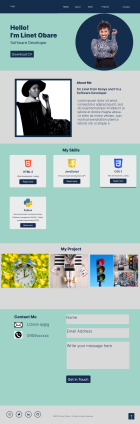
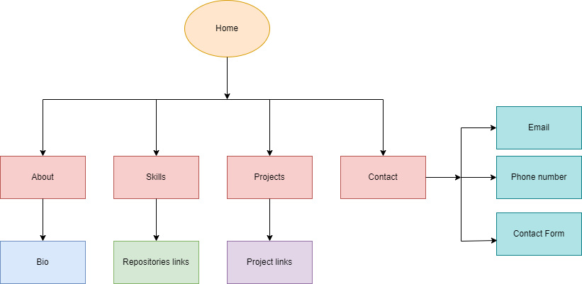

# Personal Portfolio Website

<!-- TABLE OF CONTENTS -->

# 📗 Table of Contents

- [📖 About the Project](#about-project)
- [💻 Features](#features)
- [🛠 Technologies](#technologies)
- [🚀 Live Demo](#live-demo)
- [🔭 Future Features](#future-features)
- [👤 Contacts](#contacts)
- [🙏 Acknowledgement](#acknowledgement)

<!-- About the Project -->

## Project Overview

This is the Capstone project for the Introduction to Software Engineering program [Introduction to Software Engineering Program](https://www.alxafrica.com/intro-to-software-engineering/) by [ALX Africa](alxafrica.com), required to graduate from the program.
The project gives students an opportunity to apply the skills and knowledge earned from the program.

## 📖 Project Description

My capstone project is my personal portfolio website where I showcase my work in order to increase my visibility and presence to potentail employers.

## Figma design

The figma design showcase for the personal portfolio website:

## Flowchart

The flowchart of the personal portfolio website:

<!-- Features and Functionalities-->

## 💻 Features

Key Features: Local Storage for Form Data

- Automatic Data Preservation: The implemented local storage functionality ensures that user-entered data in the form is automatically saved. Even if users navigate away from the page or accidentally refresh it, their input remains intact, providing a seamless experience.

- Persistent User Sessions: Users can return to the form at a later time and find their previously entered data still available. This feature eliminates the need for users to re-enter information, enhancing user satisfaction and convenience.

<!--Technologies used-->

## 🛠 Technologies

The technologies I have used to create my personal portfolio website are:

- HTML
- CSS
- JavaScript

 <!--Demo-->

## 🚀 Live Demo

> link to the live demo.

- [Live Demo Link]()

<!--Roadmap and future enhancements-->

## 🔭 Future Enhancements

- User-Friendly Reset Option For Form
- Code Refactoring
- Integration of Real Data

<!--Contact Information -->

## 👤 My contacts

👤 Buyeke Obare

- GitHub: [buyekeobare](https://github.com/buyekeobare)
- Linkedin: [https://www.linkedin.com/in/buyeke-obare/]

<!-- Acknowledgement -->

## 🙏 Acknowledgment

- Thank you Cole and Obed for being the best technical mentors. Every session was worth it.
